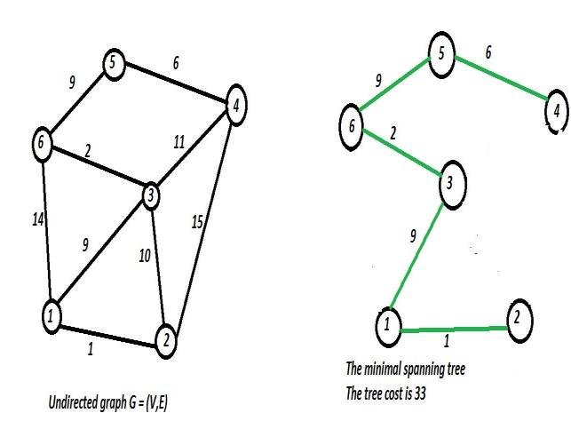

# 2 - Minimum Spanning Tree

Struktur Data Terkait : **Graf**

Algoritma Terkait : **Kruskal's Algorithm** dan **Prim's Algorithm**

## Konsep

Minimum Spanning Tree adalah suatu permasalahan graf yang mencari sebuah **tree** yang mencakup **seluruh node** sedemikian hingga total semua edge apabila dijumlah **seminimal mungkin**.

Tree sebenarnya merupakan bentuk khusus dari graf di mana tidak ada node yang membentuk suatu *siklus*). Berikut adalah perbandingannya:

Dapat dilihat pada kolom *Graph* bahwa node **D, E, F, G, H** membentuk suatu siklus (putaran) sehingga tidak bisa digolongkan sebagai tree.

Berikut adalah contoh hasil generasi minimum spanning tree:

**Contoh Kasus:** berapa panjang jalan terpendek yang dapat diaspal sehingga mencakup seluruh desa yang mulanya terhubung dengan jalan yang belum teraspal (hal tersebut dilakukan supaya pengaspalan dilakukan seminimal mungkin sehingga dapat menghemat biaya pengeluaran).

Permasalahan ini biasa dipecahkan menggunakan **algoritma Kruskal** atau **algoritma Prim**.

## Implementasi (Kruskal's Algorithm)

Algoritma Kruskal bekerja dengan urutan sebagai berikut:

1. Buat graf dalam bentuk edge list dan sortir berdasarkan bobotnya terlebih dahulu
2. Ambil edge dengan bobot terkecil, kemudian cek apakah edge yang diambil membentuk siklus antar node atau tidak. Apabila **tidak membentuk** siklus, maka masukkan edge tersebut ke dalam MST. Kemudian apabila **membentuk** siklus, maka buang edge tersebut. Pengecekan siklus dapat dilakukan menggunakan bantuan struktur data **disjoint set**
3. Ulangi langkah 2 sampai jumlah edge mencapai (V - 1) di mana V merupakan jumlah node/vertex keseluruhan dari graf

Untuk contoh dan visualisasinya dapat dilihat [di sini](https://www.geeksforgeeks.org/kruskals-minimum-spanning-tree-algorithm-greedy-algo-2/).

Contoh source code juga dapat dilihat [di sini](./2-mst-kruskal.cpp).

## Implementasi (Prim's Algorithm)

Algoritma Prim bekerja dengan urutan sebagai berikut:

1. Buat himpunan/set yang berisi **(1) sekumpulan node dalam MST** dan **(2) sekumpulan node diluar MST**
2. Buat dictionary/map yang memetakan **node** dengan suatu nilai **bobot terkecil** antara himpunan MST dengan himpunan non-MST (selanjutnya akan disebut **bobot MST**). Kemudian, atur semua nilai menjadi tak hingga (infinite)
3. Buat dictionary/map yang memetakan **node** dengan suatu node asal (atau **parent**) untuk membangun MST. Node awal (root node) tidak perlu memiliki parent
4. Selagi himpunan non-MST masih terisi (atau masih terdapat node diluar MST):
    1. Ambil salah satu node pada himpunan tersebut dengan **bobot MST terkecil**. Node yang pertama kali dikunjungi **wajib** memiliki bobot 0
    2. Masukkan node tersebut ke dalam **himpunan MST** dan keluarkan dari himpunan non-MST
    3. Perbarui semua nilai bobot MST dari **tetangga non-MST** dari node tersebut. Bobot tetangga hanya akan diperbarui apabila bobot edge dari node yang dipilih ke tetangga **lebih kecil** dari bobot MST untuk node tetangga tersebut **sebelumnya** (mulanya dijamin diperbarui karena bobot awal semuanya infinite)
    4. Apabila pada langkah sebelumnya bobot diperbarui, maka atur parent dari node tetangga tersebut supaya tetangga tersebut merupakan node anakan dari node yang dipilih

Untuk contoh dan visualisasinya dapat dilihat [di sini](https://www.geeksforgeeks.org/prims-minimum-spanning-tree-mst-greedy-algo-5/).

Contoh source code juga dapat dilihat [di sini](./2-mst-prim.cpp)